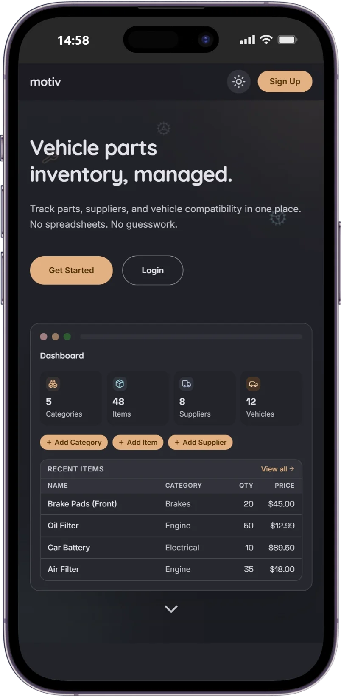
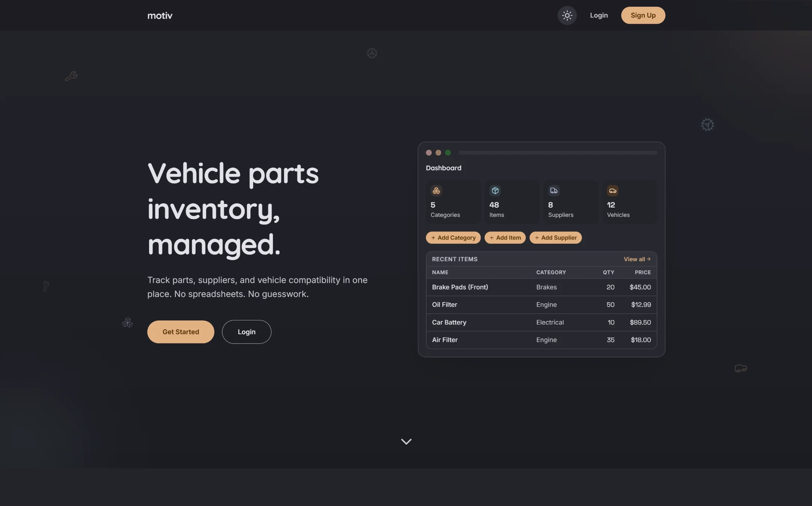
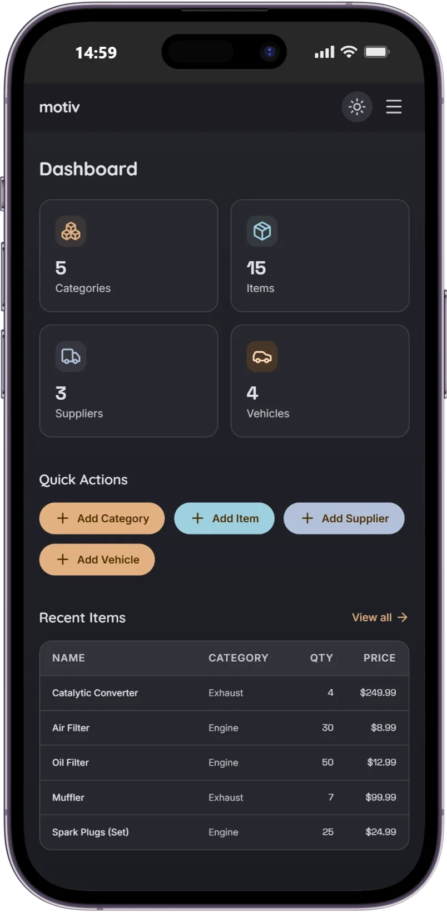
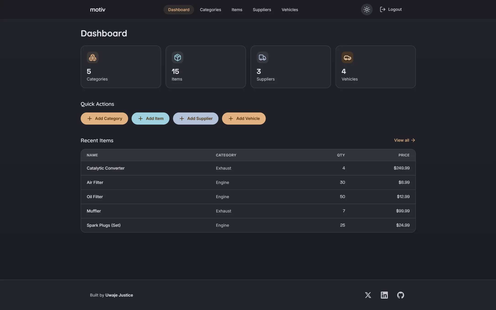
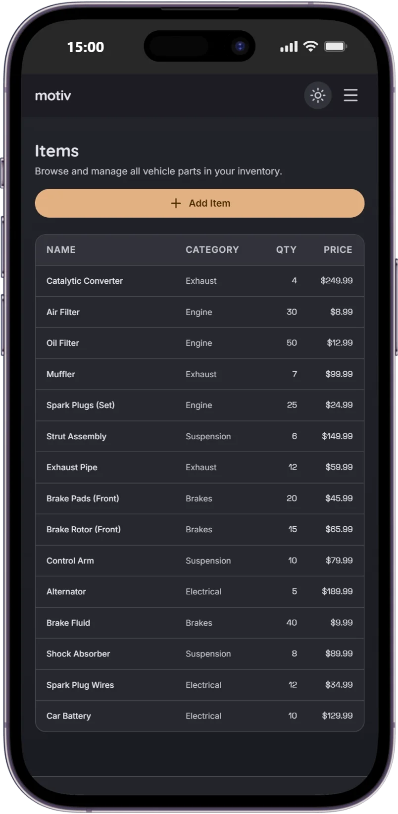
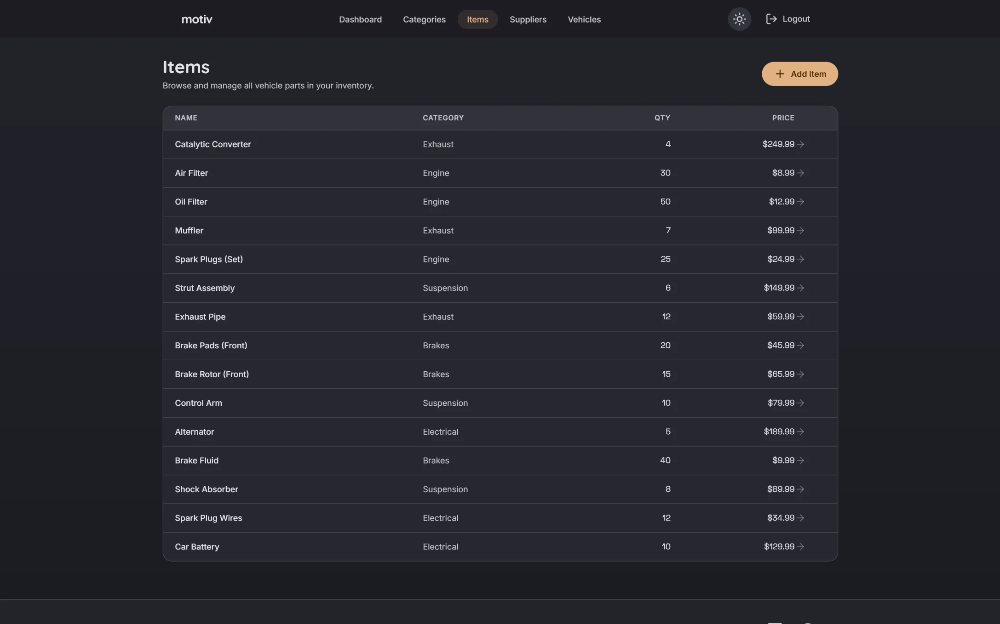
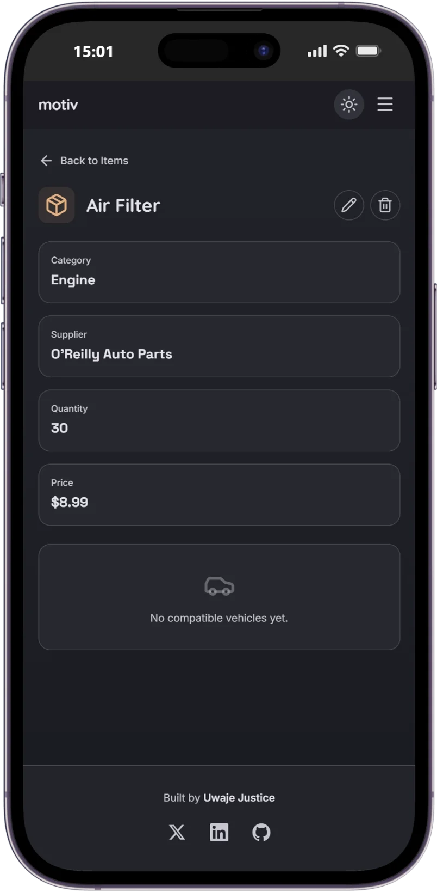
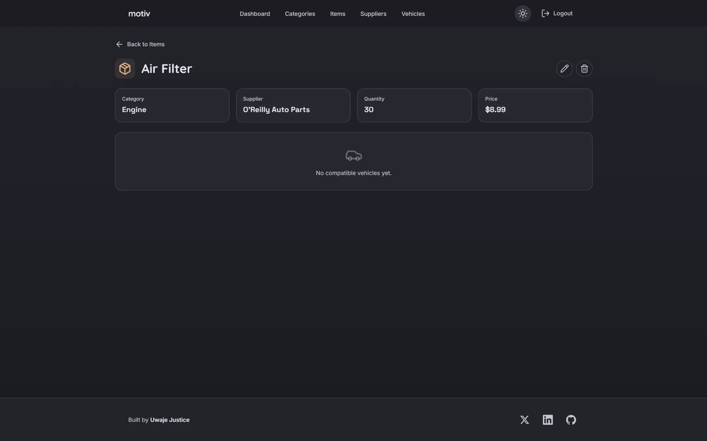
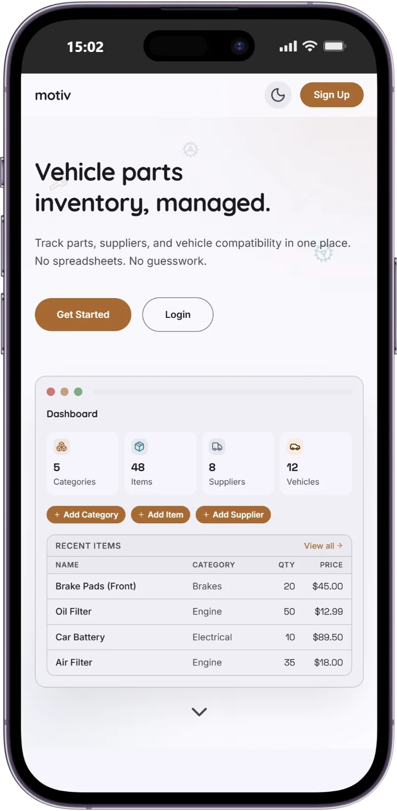
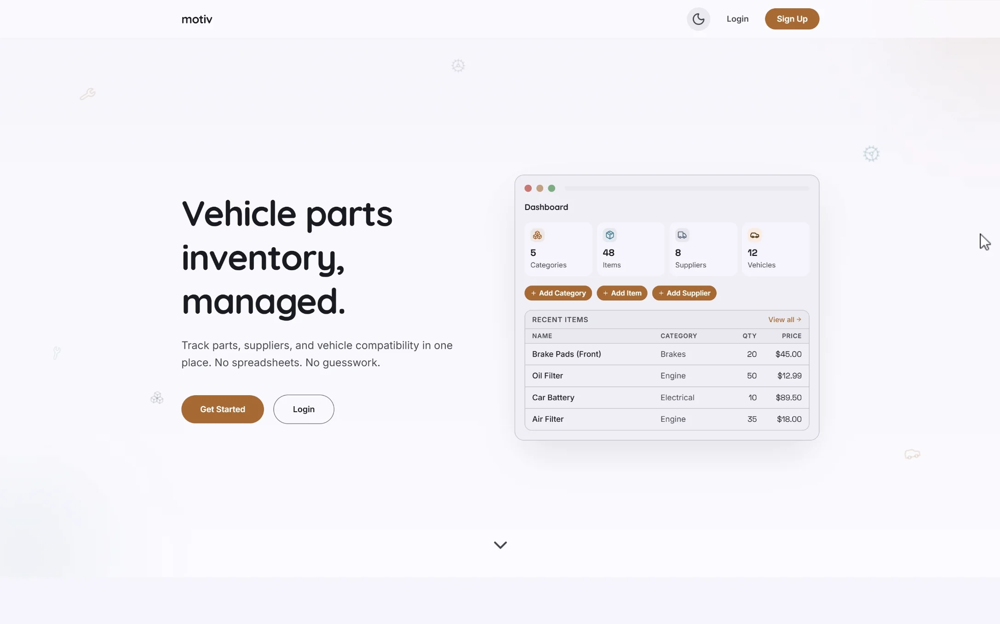

# Motiv

A full-stack inventory management app for vehicle parts. Track parts, suppliers, categories, and vehicle compatibility from one dashboard.

## What it does

- **Categories** - Organize parts by type (engine, brakes, electrical, etc.)
- **Items** - Add parts with price, quantity, category, and supplier
- **Suppliers** - Keep track of vendor contacts and info
- **Vehicles** - See which parts are compatible with which vehicles
- **Dashboard** - Overview of recent items and inventory stats
- **Auth** - Register and login with JWT authentication
- **Dark mode** - Toggle between light and dark themes

## Screenshots

### Landing page

#### mobile


#### desktop


### Dashboard

#### mobile


#### desktop


### Items

#### mobile


#### dashboard


### Item detail

#### mobile


#### dashboard


### Light mode

#### mobile


#### dashboard


## Tech stack

- **Frontend:** React 19, Vite 6, TailwindCSS 4, React Router 7
- **Backend:** Express 5, Prisma 7, PostgreSQL
- **Auth:** Passport.js with JWT strategy, bcrypt for password hashing
- **Validation:** express-validator on all API endpoints
- **Deployment:** Vercel (frontend) + Render (backend) + Prisma (database)

## Getting started

### Prerequisites

- Node.js 18+
- PostgreSQL database (or a Prisma/Supabase connection string)

### Installation

```bash
git clone https://github.com/uwaje-justice/inventory-app-top.git
cd inventory-app-top
npm install
```

### Environment variables

Create a `.env` file in the `backend/` directory:

```
DATABASE_URL=your_postgresql_connection_string
JWT_SECRET=your_secret_key
CLIENT_URL=http://localhost:3000
```

### Database setup

```bash
cd backend
npx prisma migrate dev
npx prisma db seed
```

### Running locally

```bash
# From the root directory
npm run dev
```

This starts both the backend (port 5000) and frontend (port 3000) using the Vite proxy.

### Demo account

- **Email:** demo@motiv.com
- **Password:** password123

## Project structure

```
inventory-app-top/
  backend/
    src/
      controllers/    # Route handlers
      middlewares/     # Auth, validation, error handling
      routes/         # Express route definitions
      services/       # Business logic and database queries
      utils/          # Error classes
      lib/            # Passport config, database client
    prisma/
      schema.prisma   # Database schema
      seed.js         # Seed script with demo data
  frontend/
    src/
      api/            # Axios config and API service functions
      components/     # Reusable UI components
      hooks/          # Custom React hooks
      pages/          # Page components
      utils/          # Auth and formatting utilities
```

## API endpoints

| Method | Endpoint | Description |
|--------|----------|-------------|
| POST | /api/auth/register | Create account |
| POST | /api/auth/login | Login |
| GET | /api/auth/me | Get current user |
| GET/POST | /api/categories | List/create categories |
| GET/PUT/DELETE | /api/categories/:id | Get/update/delete category |
| GET/POST | /api/items | List/create items |
| GET/PUT/DELETE | /api/items/:id | Get/update/delete item |
| GET/POST | /api/suppliers | List/create suppliers |
| GET/PUT/DELETE | /api/suppliers/:id | Get/update/delete supplier |
| GET/POST | /api/vehicles | List/create vehicles |
| GET/PUT/DELETE | /api/vehicles/:id | Get/update/delete vehicle |
| POST | /api/vehicles/:id/items | Add compatible item |
| DELETE | /api/vehicles/:id/items/:itemId | Remove compatible item |

## Deployed at

- **Frontend:** https://inventory-app-top-frontend.vercel.app
- **Backend:** https://inventory-app-top-w7ix.onrender.com
